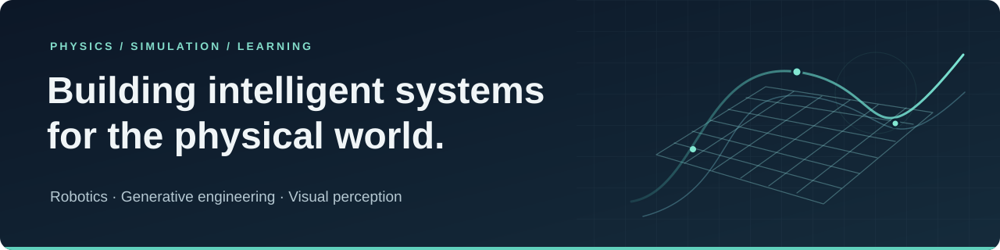

  

<h1 align="center">Maneet Chatterjee</h1>

<strong>Mechanical Engineering · Robotics · Generative Design · Computer Vision</strong>

  <a href="https://maneetchatterjee.github.io/"><strong>Portfolio</strong></a> &nbsp; / &nbsp;
  <a href="https://maneetchatterjee.github.io/assets/Maneet_Chatterjee_CV.pdf"><strong>CV</strong></a> &nbsp; / &nbsp;
  <a href="https://scholar.google.com/citations?user=Z3N1lSMAAAAJ&amp;hl=en">Google Scholar</a> &nbsp; / &nbsp;
  <a href="https://www.linkedin.com/in/maneet-chatterjee-778441190/">LinkedIn</a> &nbsp; / &nbsp;
  <a href="mailto:maneet2018@gmail.com">Email</a>

---

### About

I'm a final-year **Mechanical Engineering undergraduate at IIEST Shibpur**, working at the intersection of **robotics, AI, and aerospace engineering**. My work connects learning-based methods with physical constraints, simulation, and rigorous validation.

- **Education:** B.Tech., Mechanical Engineering · expected May 2027 · CGPA **3.63/4.00** through Semester VI.
- **Research interests:** embodied intelligence, generative engineering, digital twins, and visual perception.
- **Open to:** MS/PhD research, research collaborations, and industry R&D opportunities.

### Research & industry experience

| Organization | Role & period | Selected work |
| :--- | :--- | :--- |
| **Synopsys** | R&D Intern · Jun 2026–present | Generative eVTOL inverse design, coupling conditional latent diffusion with **SUAVE, OpenVSP, and VSPAERO**; geometric validity, solver convergence, and provenance tracking. |
| **University of Tsukuba** | Research Assistant · Mar 2026–present | Surgical-video understanding using **MedSAM/SAM 3 and VideoMAE**; **91.6% balanced accuracy / 89.7% F1** under five-fold case-disjoint validation across 28 procedures. |
| **Ansys** | R&D Intern · May–Jul 2025 | Vision-guided robotic manipulation, camera calibration, and kinematics; embedded monitoring and digital-twin validation in **Isaac Sim, Blender, and Unreal Engine**. |
| **IIEST Shibpur** | Research Assistant · Aug–Dec 2024 | Physics-based modeling of solar-powered hydrogen production and photovoltaic–electrolyzer power matching. |

### Selected projects

**Physics-gated generative CAD for aircraft inverse design**  
Probabilistic design grammars and Sobol sampling coupled to SUAVE mission analysis, **30 physical constraints**, and automated STL/OBJ generation. Produced **21/21 physically valid, watertight designs in the evaluated set**.  
[Project details →](https://maneetchatterjee.github.io/#research)

**Vision-language-action robotic manipulation**  
CLIP ViT-B/32-guided pick-and-place in **PyBullet**, with five objects and four sorting zones. A target–distractor confidence margin achieved **ROC-AUC 0.75 for execution-outcome separation** in simulation.  
[Method & evaluation →](https://maneetchatterjee.github.io/#research)

**MoonBot: rover design & reinforcement learning**  
A six-wheel rover with an articulated arm, from **SolidWorks CAD to URDF and a Gym-compatible simulation**. PPO locomotion uses mass and friction randomization; physical deployment remains future work.  
[Repository →](https://github.com/maneetchatterjee/MoonBot)

**Cross-solver CFD validation of curved cooling ducts**  
Matched conjugate heat-transfer cases in **Fluent, COMSOL, and OpenFOAM**, investigating Dean-type vortices. Improved mean Nusselt number **18% over the project baseline**, with pressure-drop predictions agreeing within **6% across solvers**.  
[Project details →](https://maneetchatterjee.github.io/#research)

### Publications & preprints

- **BMD-CD: Temporally Ordered Region-Token Mamba with Logit-Space Diffusion for Remote Sensing Change Detection**  
  **arXiv preprint · 2026.** Temporally ordered region tokens, state-space propagation, and logit-space diffusion for change localization.  
  [Paper](https://arxiv.org/abs/2609.27149) · [Code](https://github.com/Aparup2139/BMD-CD_Remote_Sensing_Change_Detection)

- **Topology-Constrained Graph-Mamba with Logit Diffusion for Change Detection**  
  **MONTI Workshop at CVPR · 2026 · First author · Non-archival.**  
  [Paper](https://drive.google.com/file/d/17JkIaBy7NDwSvhO4n0Ao3X1YUClEh4hm/view) · [Workshop](https://sites.google.com/view/monti2026/home)

- **Beyond CNNs: EfficientMamba Powered Sequence Learning and Curriculum-Guided Domain Adaptation for Fossil Classification**  
  **IEEE InGARSS · 2025.**

- **EEMAMBA: A Hardware-Aware Energy-Efficient State-Space Model for EuroSAT Classification**  
  **IEEE IGARSS · 2025 · First author.**  
  [Paper / DOI](https://doi.org/10.1109/IGARSS55030.2025.11314046) · [Code](https://github.com/maneetchatterjee/EEMAMBA)

- **ExoSpikeNet: A Light Curve Analysis Based Spiking Neural Network for Exoplanet Detection**  
  **IEEE CSNT · 2024 · First author.**  
  [Paper / DOI](https://doi.org/10.1109/CSNT60213.2024.10545663) · [Code](https://github.com/maneetchatterjee/Exoplanet-Classification-using-Spiking-Neural-Networks)

### Technical toolkit

| Area | Tools |
| :--- | :--- |
| **Programming & ML** | Python, C++, MATLAB, SQL, JavaScript, Julia · PyTorch, TensorFlow, scikit-learn, OpenCV |
| **Robotics & systems** | ROS 1/2, Isaac Sim, PyBullet, MuJoCo, Gazebo, Simulink · Raspberry Pi, MQTT |
| **Aerospace & simulation** | SUAVE, OpenVSP, VSPAERO · Fluent, OpenFOAM, COMSOL, STAR-CCM+ |
| **CAD & CAE** | SolidWorks, CATIA, Fusion 360, Siemens Designcenter · Ansys Mechanical, Abaqus |
| **Engineering workflows** | Git, Docker, LaTeX · Digital twins, IT–OT integration, InfluxDB, Grafana |

<strong>Recognition & certifications</strong>

- **GAABESU Research Award** · 2025.
- **IEEE GRSS Travel Grant** for IGARSS · 2025.
- Co-authored / presented work on **IT–OT integration and digital twins** at the 6th Ansys TechCon and 2nd AIIoT · 2025.
- Deep Learning Specialization · 2026; SOLIDWORKS Professional · 2025; MATLAB Deep Learning · 2024.

<strong>Contribution activity</strong>

---

**Let's connect:** [maneet2018@gmail.com](mailto:maneet2018@gmail.com) · [LinkedIn](https://www.linkedin.com/in/maneet-chatterjee-778441190/) · [X](https://x.com/maneet2018) · [Kaggle](https://www.kaggle.com/maneetchatterjee)

Kolkata, India · Updated October 2026

